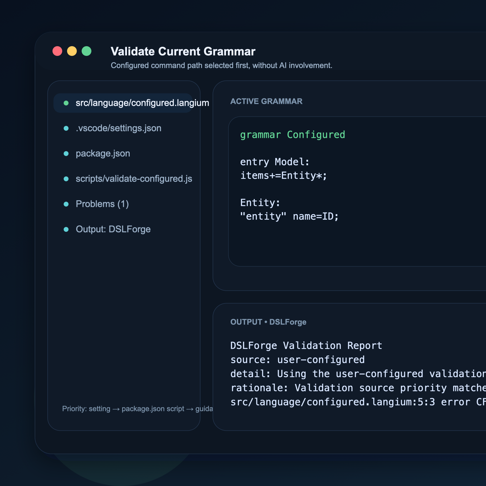
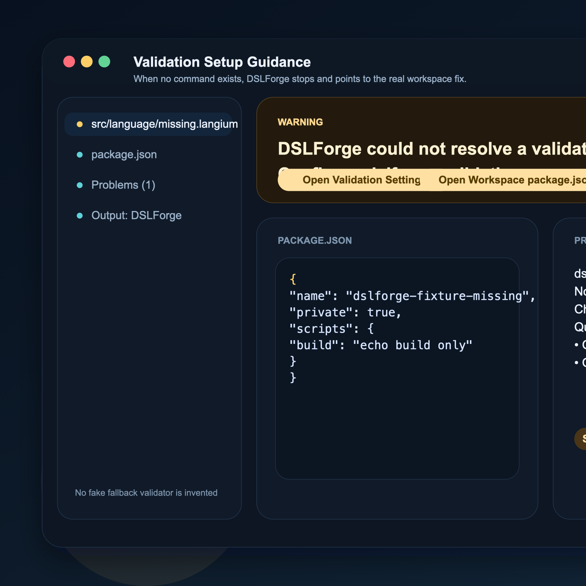
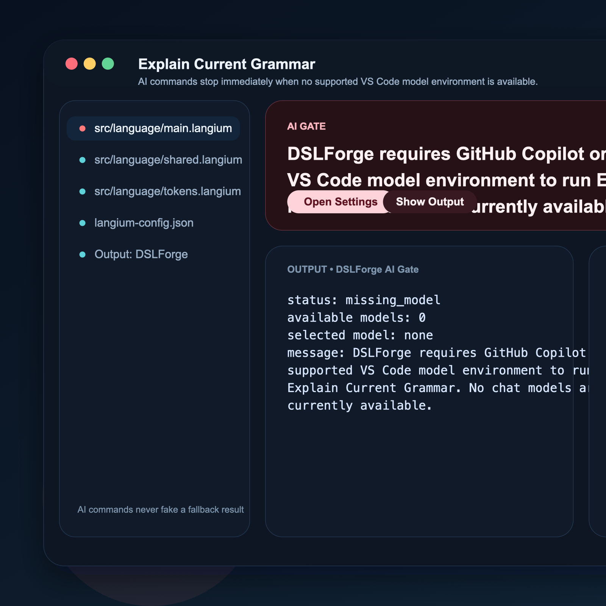
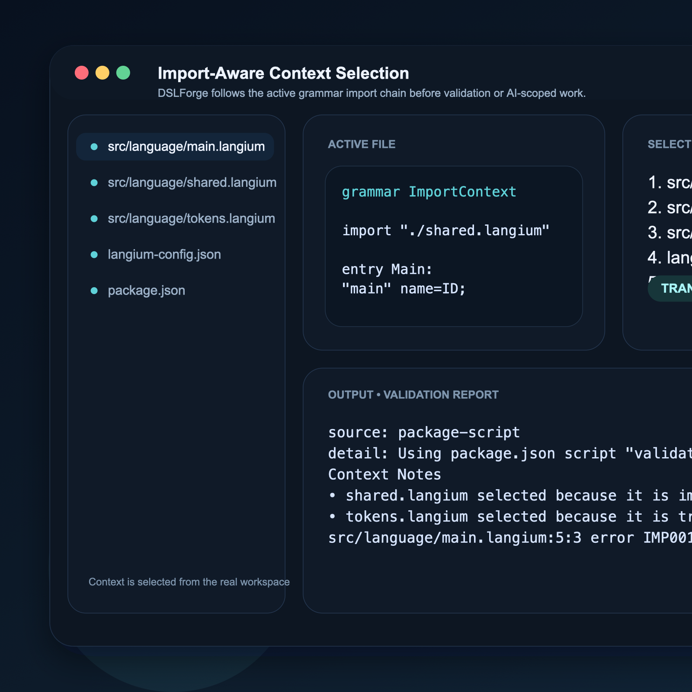

# DSLForge

DSLForge is a VS Code extension for DSL authoring workflows, starting with Langium.

It is not a generic AI generator. In v0.1, it focuses on the real loop around grammar work: detect the active DSL project, choose the right context, run the workspace's actual validation path, and present diagnostics in a form you can act on.

## Current Status

DSLForge is currently a pre-release extension.

- v0.1 supports Langium only
- `Validate Current Grammar` is intentionally non-AI
- AI commands require GitHub Copilot or another supported VS Code model environment
- if AI access is unavailable, DSLForge stops and shows guidance instead of inventing a fake fallback

## What DSLForge Does

- detects the current Langium workspace and grammar context
- follows import-aware grammar context selection
- resolves validation from the real workspace in this order:
  1. `dslforge.validation.command`
  2. auto-detected supported `package.json` script
  3. setup guidance
- publishes normalized diagnostics into Problems
- uses AI only for explicitly AI-scoped authoring tasks

## What DSLForge Does Not Do

- it does not replace Langium, ANTLR4, or Xtext
- it does not try to be a generic AI coding copilot
- it does not fake a validation engine when the workspace has not defined one
- it does not fake AI output when no supported model environment is available

## Screenshots

### Validation Through The Real Workspace Command

`Validate Current Grammar` prefers the user-configured command before trying `package.json` scripts.

### Validation Setup Guidance Instead Of Fake Fallbacks

When no configured command or supported script exists, DSLForge stops and points to the real setup actions.

### AI Gate Blocks Cleanly When Model Access Is Missing

AI-scoped commands stop immediately and explain what must be configured.

### Import-Aware Context Selection

DSLForge uses the active grammar and its import chain instead of sending arbitrary workspace files.

## Install

After the Marketplace listing is live, install `DSLForge` from VS Code Marketplace.

Until then, you can evaluate it locally:

1. run `npm install`
2. run `npm exec -- vsce package`
3. install the generated `dslforge-0.0.1.vsix` in VS Code

## One-Minute Flow

1. Open a Langium workspace.
2. Open the grammar file you are working on.
3. Run `DSLForge: Validate Current Grammar`.
4. If DSLForge cannot resolve a validation command, set `dslforge.validation.command` or add a supported `package.json` script.
5. Use the AI commands only if VS Code already has a supported model environment available.

Recommended first local check from this repository:

1. open `test-fixtures/langium/configured-command`
2. open `src/language/configured.langium`
3. run `DSLForge: Validate Current Grammar`

Expected result:

- DSLForge selects the configured validation command first
- validation output is streamed to the Output panel
- normalized diagnostics are surfaced in Problems

## Commands

Non-AI:

- `DSLForge: Validate Current Grammar`

AI-backed:

- `DSLForge: Explain Current Grammar`
- `DSLForge: Create DSL Scaffold`
- `DSLForge: Generate Sample DSL`

## Validation Behavior

`Validate Current Grammar` is intentionally non-AI.

Validation priority:

1. `dslforge.validation.command`
2. supported `package.json` script auto-detection
3. setup guidance

This keeps DSLForge aligned with the workspace's real build and CI behavior instead of inventing an internal validation path that does not match the project.

## AI Limits

The following commands require GitHub Copilot or another supported VS Code model environment:

- `Explain Current Grammar`
- `Create DSL Scaffold`
- `Generate Sample DSL`

If model access is unavailable, DSLForge:

- stops before making any model request
- shows setup or sign-in guidance
- records the AI gate result in the Output channel
- does not create a fake preview document

## Langium-Only Scope In v0.1

The first release supports Langium only.

Current responsibilities:

- project detection
- context selection
- validation orchestration
- diagnostics presentation

Planned adapter sequence:

- v0.2: ANTLR4 adapter
- v0.3: Xtext adapter
- v0.4: Generic mode

## Settings

Current extension settings:

- `dslforge.validation.command`
- `dslforge.validation.maxCapturedOutputCharacters`
- `dslforge.ai.maxContextFiles`
- `dslforge.ai.maxCharactersPerFile`
- `dslforge.ai.maxContextCharacters`

## Development

Useful commands:

- `npm run build`
- `npm run typecheck`
- `npm run test`
- `npm run test:diagnostics`
- `npm run test:projects`
- `npm run test:manifest`
- `npm run generate:screenshots`
- `npm exec -- vsce package`

Release notes live in [CHANGELOG.md](CHANGELOG.md).
